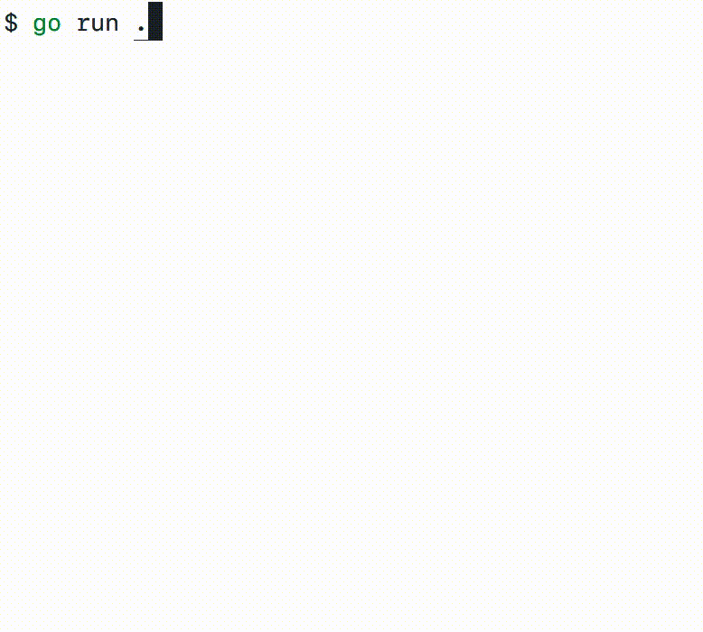

# cli

Utilities for Go CLI projects.

## Package `output`

```go
p, _ := output.NewPrinter(output.PrinterConfig{})

p.H1().Print("Print\n")
p.H1().Printf("%s\n", "Printf")
p.H1().Println("Println")

p.H2().Print("Print\n")
p.H2().Printf("%s\n", "Printf")
p.H2().Println("Println")

p.Print("Print\n")
p.Printf("%s\n", "Printf")
p.Println("Println")

p.Err().Print("Print\n")
p.Err().Printf("Printf\n")
p.Err().Println("Println")

p.Printf("Waiting.\n")
w := p.WaitIndicator(ctx)
time.Sleep(5 * time.Second)
w.Stop()
p.Printf("Waited.\n")

p.Success()
```

The code above will print:


